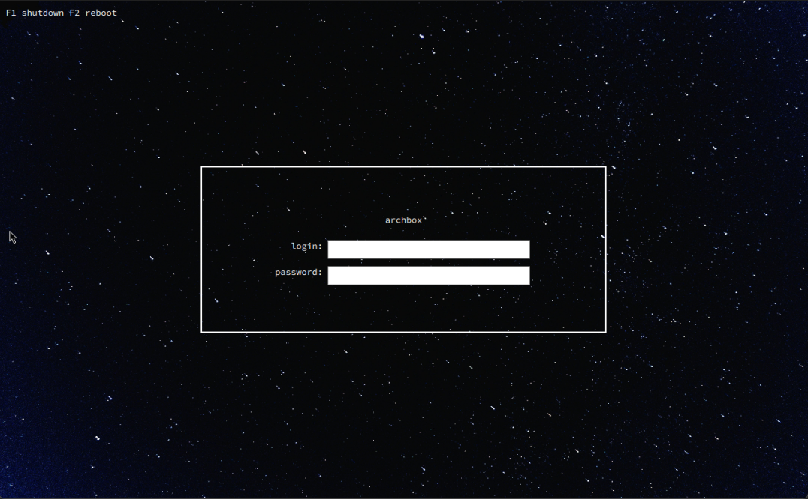

<h2 align="center"> SDDM Theme - Nightsky </h2>

<p align=center>
 A simple, relaxing theme for the <a href="https://github.com/sddm/sddm">SDDM Login Manager.</a> Won't wake you up at night!
</p>

<h2 align=center>Preview</h2>
<center>

</center>

## How SDDM Themes Work

SDDM is the typical greeter (i.e., login manager) for KDE Plasma Linux Systems. It is closely integrated with the Plasma desktop and with Plasma 6, the integration has become even closer. 

SDDM's basic configuration is ugly, but the possibilities for customization are immense. A display manager paired with a modern distro should look good. SDDM is written using Qt libraries.  

Customizing using SDDM is very easy. In most cases, SDDM looks for themes in /usr/share/sddm/themes, so any themes we want to use should be placed in that directory. Distros like Fedora often come with themes, so the directory may not be empty. 

Switch to a different theme by editing the SDDM configuration file. It is located at /etc/sddm.conf. To change to the nightsky theme, for example, we would go to the [Theme] section and change it to look like:

```

[Theme]
Current=nightsky

```

### Previewing Themes

To get a preview of a new SDDM theme without needing to logout and login repeatedly, we can run the sddm-greeter utility to get a preview. We would pass the directory we want to test as the argument like so:

```

$ sddm-greeter --test-mode --theme /usr/share/nightsky

```

Once you're happy with the theme, you can apply it.


## Install 

> The below assumes that SDDM has been installed and configured properly. Improper configuration can lead to compilation errors. For more information [see the wiki](https://wiki.archlinux.org/title/SDDM). 

### Dependencies

need adobe source code pro fonts

### From Source

1. Start by cloning the source code:

```
git clone https://github.com/spiritualhost/sddm-nightsky.git ~/nightsky
```

2. Move the theme to the proper folder

```
sudo mv ~/nightsky /usr/shre/sddm/themes
```

3. Install the Dependencies

- Arch Linux:
```
#QML dependencies
sudo pacman -S qt5-base qt5-declarative qt5-quickcontrols qt5-quickcontrols2 qt5-quicklayouts qt5-quickshapes

#Font
sudo pacman -S adobe-source-code-pro-fonts
```

4. Create '/etc/sddm.conf' if it doesn't exist already and then add nightsky as the theme

```
sudo touch /etc/sddm.conf
sudo nano /etc/sddm.conf
```

Add the following to sddm.conf:

```
[Theme]
Current=nightsky
```

Then feel free to reboot to see it in action. If anything breaks at the first reboot, jump into the TTY (usually Ctrl+Alt+F3, but varies), and delete/edit the conf. Previewing helps to show any compilation errors before they cause problems. 

## Configure

Some configuration settings can be changed, including the background image in the theme.conf. 

## Credits

Initial stylistic inspiration was the [ly greeter](https://github.com/fairyglade/ly). I hope more features can be added in the future to get even closer (e.g., the background animations).  

Some minor logical inspiration came from the [Maldives SDDM theme](https://github.com/ArtemSmaznov/SDDM-themes.git), but the changes were significant. The license is included as COPYING regardless. Copyright (C) 2012 Dr. Peter Schmidt

The wallpaper was taken from [here](https://unsplash.com/photos/cluster-of-stars-in-the-sky-qVotvbsuM_c). It was created by [Paul Lichtblau](https://unsplash.com/@laup) and is covered under the [Unsplash Free Use License](https://unsplash.com/license). 


Some sites which were helpful:
- https://linuxconfig.org/how-to-customize-the-sddm-display-manager-on-linux


## License

[GNU Lesser General Public License v3.0](LICENSE)
